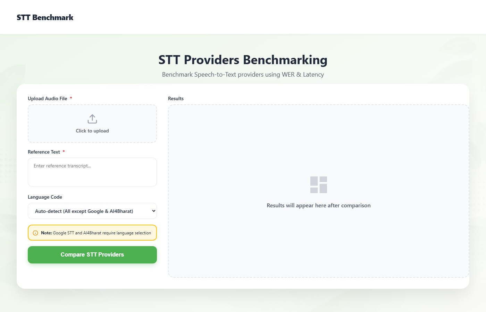

# STT Benchmark — Frontend

[](https://github.com/SASHI117/stt-benchmark-frontend/actions/workflows/ci.yml)


The web UI for [stt-benchmark-backend](https://github.com/SASHI117/stt-benchmark-backend).
Upload a clip, paste the reference transcript, optionally pick a language,
and compare every configured speech-to-text provider side by side on
**WER** and **latency**. It is plain HTML, CSS and JavaScript, so there is
nothing to build and it can be hosted anywhere static files are served.



## What it does

- Sends `multipart/form-data` (`audio`, `reference_text`, `language_code`) to `POST /benchmark`
- Renders one row per provider/model with WER, latency, a
  **Success / Skipped / Failed** badge, and the transcript. When a provider
  returns nothing, the row shows the provider's error message instead
- Sorts by WER or latency. Rows without a value always sort to the bottom
- Exports the run as JSON (reference, language, per-model transcript, WER,
  latency, status, error) for offline comparison across many clips

## Files

| File | Purpose |
|---|---|
| `index.html`, `style.css` | Layout and styling |
| `config.js` | Backend URL, the only thing to change per deployment |
| `lib.js` | Pure helpers (status mapping, sorting, formatting, export), shared with the tests |
| `script.js` | DOM wiring: form submit, rendering, sorting, download |
| `tests/lib.test.js` | `node:test` unit tests for `lib.js` |

## Running locally

```bash
# 1. start the backend on :8000 (see the backend README)
# 2. serve this folder
npx serve -l 5173 .        # or: python -m http.server 5173
```

Open <http://localhost:5173>. When the page is served from `localhost`,
`config.js` points at `http://localhost:8000`. Otherwise it uses the URL set in
that file.

## Deploying

Any static host works (Vercel, Netlify, GitHub Pages, Nginx). Set
`backendUrl` in `config.js`, and add the frontend's origin to the backend's
`CORS_ORIGINS`.

The default `backendUrl` is the original Render deployment, which is no longer
responding, so point it at your own backend before deploying.

## Tests

```bash
npm test          # node:test, no dependencies
npm run check     # syntax check of every script
```

## Security note

An earlier version had a login page that checked a username and password
**hard-coded in the JavaScript**. Anyone can read that from the page source,
so it protected nothing. I removed it rather than hide it better, because
access control has to be enforced where the API keys are, on the backend
or a gateway in front of it. Until that exists, deploy the backend
privately or restrict `CORS_ORIGINS`.
